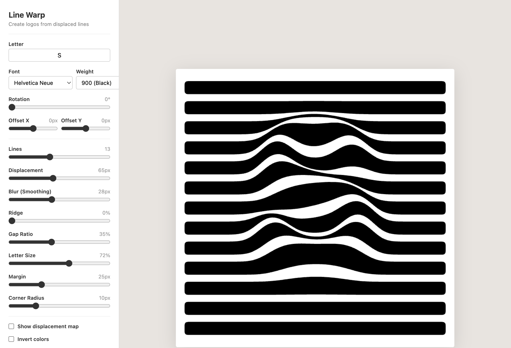

# Line Warp

**[Try it live →](https://natemodi.com/line-warp)**

Type a letter. It warps horizontal lines into a logo using displacement mapping. Tweak the sliders until it looks right, then export as PNG or SVG. One HTML file, no dependencies, runs entirely in your browser.

MIT License
